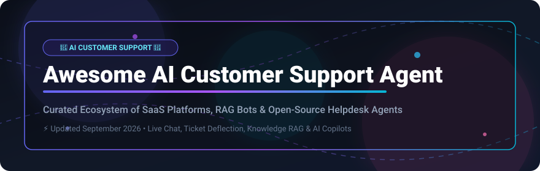

  
  
  
  
  

  

# 🤖 Awesome AI Customer Support Agent

> **A curated ecosystem of SaaS platforms, RAG-powered helpdesk systems, and Open-Source projects for AI Customer Support Agents, Ticket Deflection, Omnichannel Service Bots, and Human–AI Collaboration.**

---

## 💡 Overview & SEO Keywords

Welcome to the definitive index for **AI Customer Support Agents**! Whether you are looking for enterprise turnkey SaaS platforms like **Salesforce Agentforce**, **Intercom Fin**, and **Sierra AI**, or self-hosted open-source stacks like **Chatwoot**, **Dify**, and **Rasa**, this repository tracks the top solutions enabling autonomous customer resolution, knowledge retrieval (RAG), ticket routing, and seamless human agent handoffs.

* **Key Search Terms:** `AI Customer Support Agent`, `AI Helpdesk Automation`, `Automated Ticket Deflection`, `RAG over Help Center`, `Omnichannel Customer Support Chatbot`, `Intercom Fin Alternatives`, `Open Source Helpdesk AI`, `Conversational AI Customer Service`.

---

## 📑 Table of Contents
- [🏢 SaaS & Commercial Platforms](#-saas--commercial-platforms)
- [🔓 Open-Source GitHub Projects](#-open-source-github-projects)
- [🛠️ Key Frameworks & Architecture Stack](#%EF%B8%8F-key-frameworks--architecture-stack)
- [🤝 How to Contribute](#-how-to-contribute)
- [📈 Star History](#-star-history)
- [💖 Support & Buy Me a Coffee](#-support--buy-me-a-coffee)
- [⚠️ Disclaimer](#%EF%B8%8F-disclaimer)

---

## 🏢 SaaS & Commercial Platforms

> 📊 **Market Size & Industry Dynamics:**  
> The global AI customer support & helpdesk automation market is estimated at **~$12.5 Billion** and is projected to surpass **~$35 Billion by 2030** (growing at a CAGR >23%). The sector is currently **moderately fragmented**, with legacy enterprise CRM incumbents (*Salesforce, Zendesk, Freshworks*) actively competing against hyper-growth AI-native unicorns (*Sierra AI, Decagon, Intercom Fin, Ada*) for autonomous customer resolution dominance.

The following commercial solutions provide turnkey, enterprise-grade autonomous resolution, omnichannel integrations, and direct grounding in company knowledge bases:

| 🏢 Product / Platform | 💰 Company Valuation / Revenue | 💵 Starting Price | 🎁 Free Tier / Trial Limit | ⚡ Key Features & Capabilities |
| :--- | :--- | :--- | :--- | :--- |
| **[Salesforce Agentforce](https://www.salesforce.com/agentforce/)** | **~$300 Billion** *(Public: CRM)* | **$2.00** / conversation *(or $125/user/mo Service Cloud)* | **30-day free trial** with Service Cloud sandbox | Enterprise autonomous AI service agents grounded in Salesforce Data Cloud & CRM workflows. |
| **[Zendesk AI](https://www.zendesk.com/)** *(incl. Ultimate.ai)* | **~$10.2 Billion** *(Acquired)* | **$55.00** / agent / mo *(Growth)* + **$1.50** / AI resolution | **14-day free trial** *(no credit card required)* | Native ticketing copilot, macro recommendations, and autonomous conversation bots via Ultimate.ai engine. |
| **[Sierra AI](https://sierra.ai/)** | **~$4.5 Billion** *(Unicorn)* | **$2.00** / resolved interaction *(Outcome-based)* | **30-day custom enterprise pilot** upon request | Founded by Bret Taylor; focuses on hyper-authentic brand voice and complex enterprise resolution logic. |
| **[Intercom Fin](https://www.intercom.com/fin)** | **~$3.6 Billion** / **$400M ARR** *(Acquired by SF)* | **$0.99** / successful resolution *(+$39/seat/mo base)* | **14-day free trial** *(includes 50 free Fin resolutions)* | Industry benchmark for instant RAG answers over help centers with zero setup & human agent handover. |
| **[Freshdesk Freddy AI](https://www.freshworks.com/freshdesk/)** | **~$3.5 Billion** *(Public: FRSH)* | **$15.00** / agent / mo + **$29.00** / 100 Freddy sessions | **14-day free trial** *(up to 10 agents, full features)* | Freshworks AI copilot for ticket summaries, tone adjustment, and automated support session resolution. |
| **[Ada](https://www.ada.cx/)** | **~$1.2 Billion** *(Unicorn)* | **$1.50** / resolution *(Min commit ~$1,000/mo)* | **14-day sandbox demo trial** upon request | Enterprise omnichannel AI agent specializing in complex customer reasoning, voice, and multi-language support. |
| **[Decagon](https://decagon.ai/)** | **~$1.0 Billion** *(Unicorn)* | **$1.00** / resolved ticket *(Min commit ~$2,000/mo)* | **14-day custom proof-of-concept sandbox** | AI customer service agent trained on past support tickets and internal workflows for high resolution rates. |
| **[Forethought](https://forethought.ai/)** | **~$500 Million** *($90M+ Raised)* | **$1.50** / resolved ticket *(Base from ~$1,000/mo)* | **14-day sandbox pilot** upon request | Generative AI suite (Solve, Triage, Assist) for automated routing, ticket resolution, and agent workflow aid. |
| **[Parloa](https://www.parloa.com/)** | **~$300 Million** *($98M+ Raised)* | **$0.50** / interaction or **$0.15** / min *(Base ~$1,500/mo)* | **14-day developer sandbox trial** | AI agent platform tailored for enterprise phone customer service, voice AI, and live contact centers. |

---

## 🔓 Open-Source GitHub Projects

These self-hostable open-source projects, RAG builders, and inbox frameworks empower engineering teams to build fully custom AI customer support agents without vendor lock-in.

*Sorted by GitHub Star Count (Descending):*

| 📦 Repository / Project | ⭐ GitHub Stars | 📜 License | 🛠️ Tech Stack & Primary Customer Support Focus |
| :--- | :---: | :---: | :--- |
| **[langgenius/dify](https://github.com/langgenius/dify)** |  | Apache-2.0 | Visual LLM application builder & RAG engine used to deploy customer support bots over help centers. |
| **[open-webui/open-webui](https://github.com/open-webui/open-webui)** |  | MIT | Extensible WebUI interface for self-hosted LLMs; popular for internal support agent assist & internal KB Q&A. |
| **[Mintplex-Labs/anything-llm](https://github.com/Mintplex-Labs/anything-llm)** |  | MIT | Full-stack desktop/Docker AI application to turn support documentation & PDFs into instant RAG chatbots. |
| **[FlowiseAI/Flowise](https://github.com/FlowiseAI/Flowise)** |  | MIT | Drag & drop UI for LangChain to build custom customer support workflows, ticket routers, and RAG agents. |
| **[LibreChat-AI/LibreChat](https://github.com/LibreChat-AI/LibreChat)** |  | MIT | Enterprise-grade multi-model chat UI with agent capabilities, search, and knowledge base integration. |
| **[chatchat-space/Langchain-Chatchat](https://github.com/chatchat-space/Langchain-Chatchat)** |  | MIT | Offline RAG knowledge base QA system based on LangChain & Milvus for enterprise support desks. |
| **[chatwoot/chatwoot](https://github.com/chatwoot/chatwoot)** |  | MIT | #1 open-source omnichannel customer support platform (Live chat, Email, WhatsApp) + Captain AI agent. |
| **[labring/FastGPT](https://github.com/labring/FastGPT)** |  | Apache-2.0 | Knowledge base Q&A platform designed for fast, accurate self-hosted customer support bot deployments. |
| **[activepieces/activepieces](https://github.com/activepieces/activepieces)** |  | MIT | Open-source no-code workflow automation engine for routing support tickets, AI webhooks, and CRM sync. |
| **[RasaHQ/rasa](https://github.com/RasaHQ/rasa)** |  | Apache-2.0 | Open conversational AI framework for building enterprise-grade deterministic & generative support dialogues. |
| **[botpress/botpress](https://github.com/botpress/botpress)** |  | AGPL-3.0 / Commercial | Developer platform for building, testing, and deploying custom AI support chatbots with visual flow builders. |
| **[baptisteArno/typebot.io](https://github.com/baptisteArno/typebot.io)** |  | AGPL-3.0 | Conversational builder for creating interactive customer triage forms, FAQ widgets, and support flows. |
| **[papercups-io/papercups](https://github.com/papercups-io/papercups)** |  | MIT | Open-source customer messaging platform & live chat widget designed as a developer alternative to Intercom. |
| **[getzep/zep](https://github.com/getzep/zep)** |  | Apache-2.0 | Fast, scalable long-term memory store for AI support agents to remember customer history across sessions. |
| **[dust-tt/dust](https://github.com/dust-tt/dust)** |  | MIT | Custom AI assistant platform connected to company Notion, Slack, and Google Drive for team support assist. |

---

## 🛠️ Key Frameworks & Architecture Stack

When building custom production-grade AI support systems, developers combine:
1. **Omnichannel Inbox Layer:** [Chatwoot](https://github.com/chatwoot/chatwoot) or [Papercups](https://github.com/papercups-io/papercups) for handling live customer chats, emails, and WhatsApp messages.
2. **AI Agent Brain & RAG:** [Dify](https://github.com/langgenius/dify), [Flowise](https://github.com/FlowiseAI/Flowise), or [FastGPT](https://github.com/labring/FastGPT) connected to vector databases indexing help center articles & past tickets.
3. **Conversational Memory:** [Zep](https://github.com/getzep/zep) for persistent customer session context and personalization.
4. **Human Handoff & Escalation:** Custom webhook rules and agent co-pilot suggestions when confidence scores fall below threshold.

---

## 🤝 How to Contribute

Contributions are highly appreciated! To submit a new SaaS platform or Open-Source project:
1. Fork the repository.
2. Add your project under the appropriate section in **alphabetical** or **star-sorted** order.
3. Include verified pricing, free trial details, or star counts.
4. Open a Pull Request with a clear title and description.

---

## 📈 Star History

---

## 💖 Support & Buy Me a Coffee

Thank you for exploring **Awesome AI Customer Support Agent**! If this repository has helped your work, research, or product decisions, please consider supporting its development:

- ⭐ **Star this repository** to help others discover it on GitHub.
- 🔀 **Fork & Share** with your colleagues, engineering teams, and community.
- ☕ **Buy Me a Coffee / Sponsor:** Support ongoing maintenance via the [GitHub Sponsor Dashboard](https://github.com/sponsors/ishandutta2007).

  

---

## ⚠️ Disclaimer

*This list is maintained for informational and educational purposes. Product pricing, funding valuations, and free tier terms are subject to change by respective owners. Please refer to official vendor websites for current commercial terms.*
